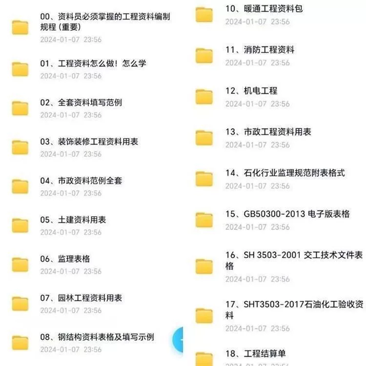
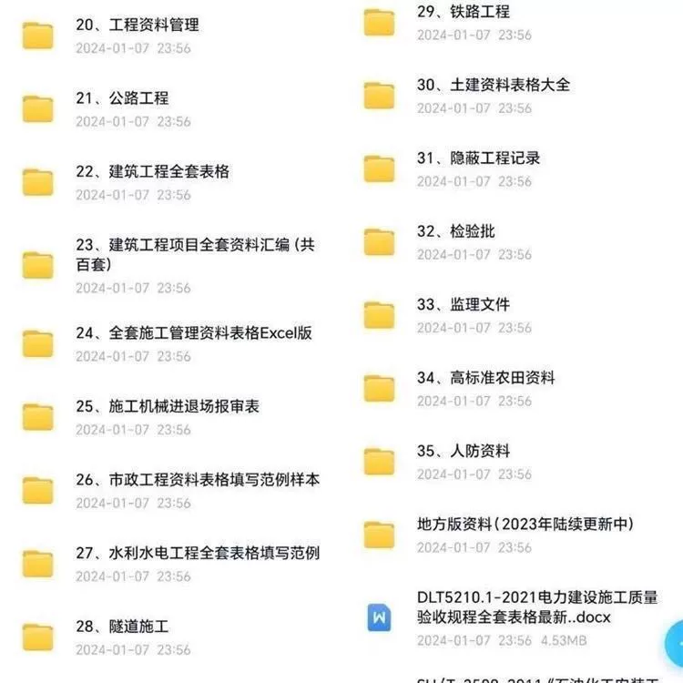
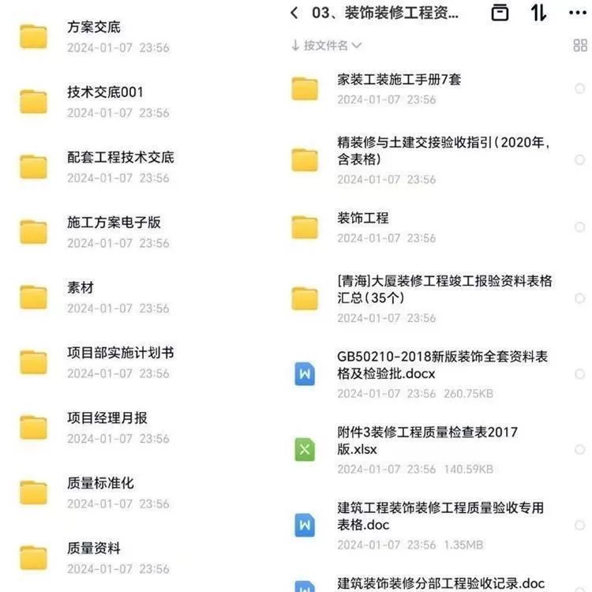
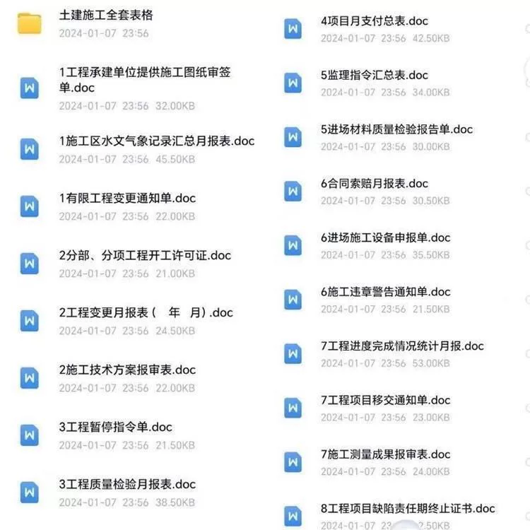
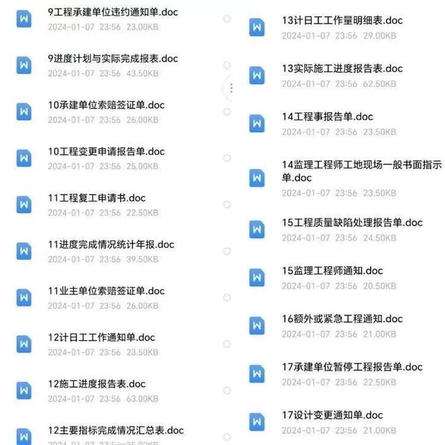
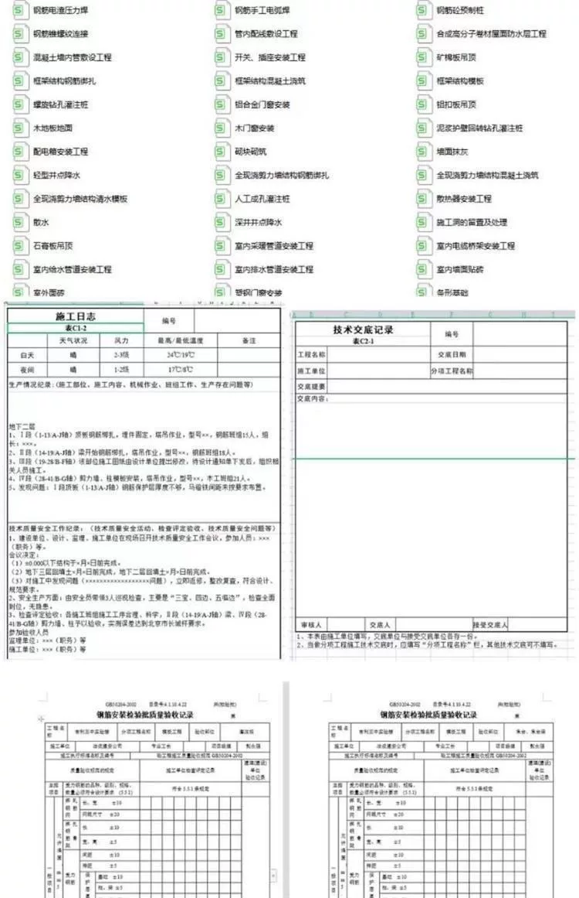
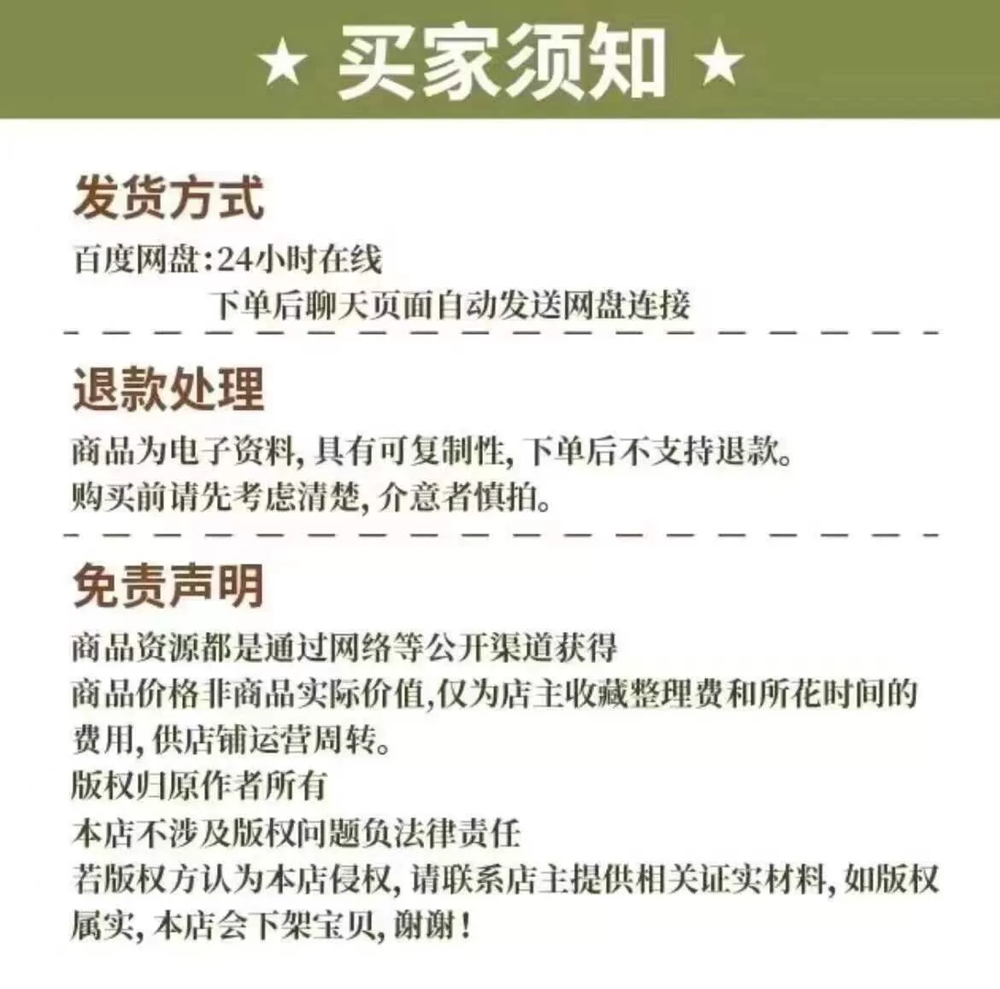

# "Instant Delivery" in the context of construction engineering documents generally refers to the need for swift preparation and submission of engineering drawings, reports, or other relevant documents. Below is a template set of construction engineering documents, including tables and documents, to help quickly complete these tasks:

## Body

"Instant Delivery" Complete Table Templates for Construction Project Information

(Full product description was not available from the source page.)

## Images

## Payment

Here is a pay link on Stripe ( https://buy.stripe.com/3cs8yP7sY87d0vu9AB ). Please contact me lonlonago@foxmail.com after funding $89, and I will send you a complete data files , thank you!

